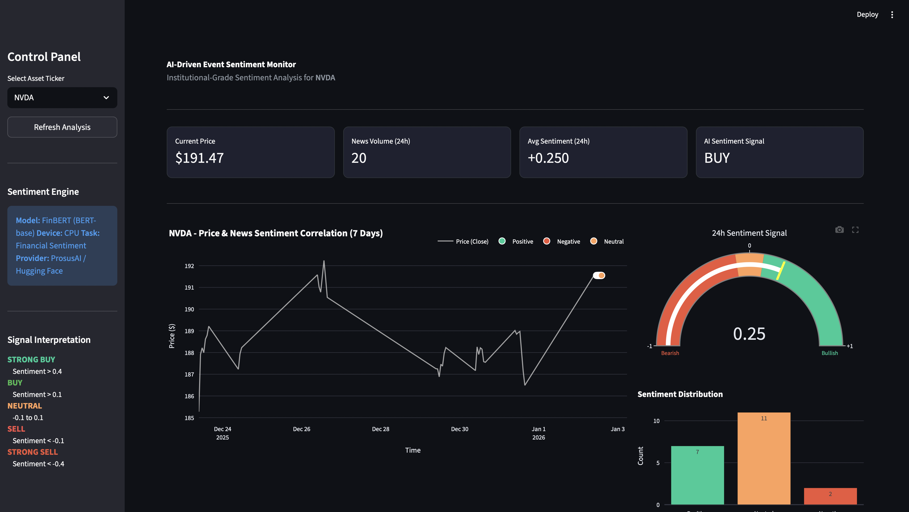

# Real-Time AI Sentiment Analysis Engine (FinBERT)

[](HIER_DEIN_STREAMLIT_LINK_EINFÜGEN)
[](https://huggingface.co/ProsusAI/finbert)
[](https://pytorch.org/)
[](https://opensource.org/licenses/MIT)

> **Live Dashboard:** [https://nlp-sentiment-quant-monitor.streamlit.app]

## Abstract

This project implements an institutional-grade event monitoring system that leverages Transfer Learning (BERT) to quantify market sentiment from unstructured financial news. By integrating real-time RSS ingestion with the FinBERT Large Language Model, the engine extracts alpha signals and correlates them with high-frequency price movements.

The system processes financial headlines through a pre-trained transformer architecture, mapping linguistic features to sentiment classifications that can inform systematic trading strategies.

---

## Dashboard Interface


*Figure 1: Real-time analysis showing price-sentiment correlation, 24h aggregate signal gauge, and volume distribution.*

---

## System Architecture

The application is built on a modular, object-oriented framework designed for scalability and low-latency inference:

```mermaid
graph TD
    A[RSS Feeds] -->|Raw XML| B(NewsIngestor)
    C[Yahoo Finance API] -->|OHLCV Data| D(MarketDataLoader)
    B -->|Cleaned Text| E{FinBertAnalyzer}
    E -->|Tokens| F[HuggingFace Transformer]
    F -->|Logits| G[Softmax Layer]
    G -->|Sentiment Score| H[Signal Generator]
    H --> I[Streamlit Dashboard]
    D --> I